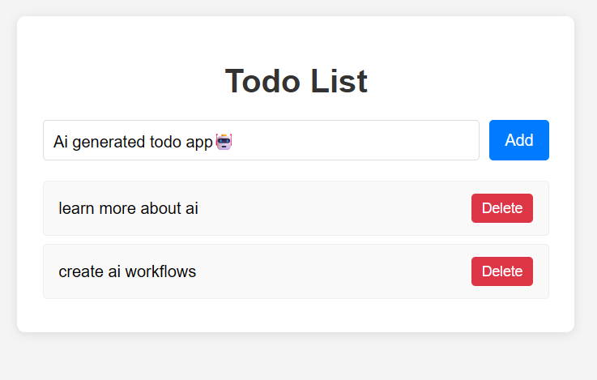
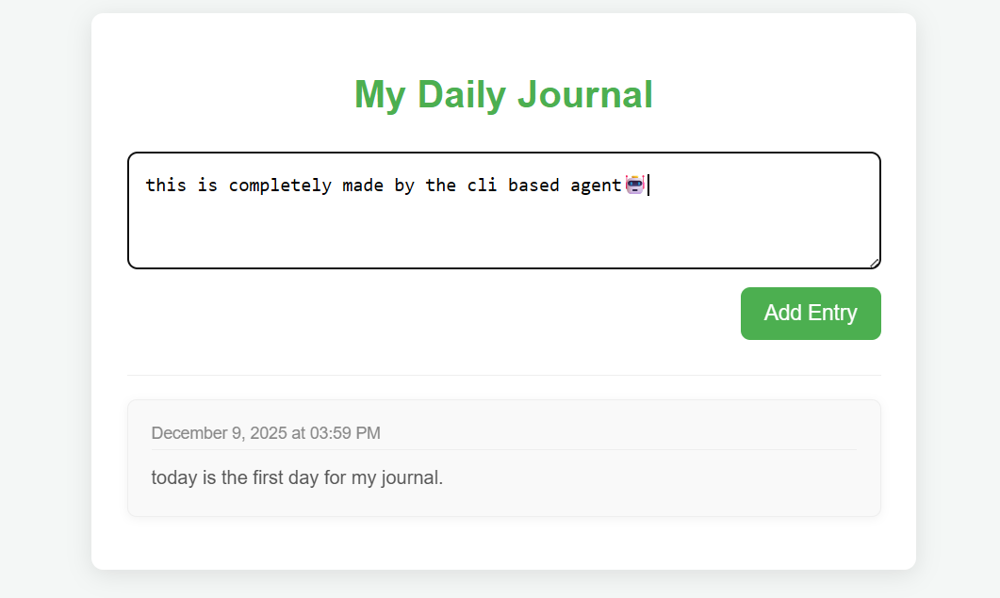

# 📁 CLI Web Project Agent
- A CLI-based agent for generating HTML, CSS, and JavaScript files using Chain-of-Thought prompting and structured Pydantic schemas.
🚀 Overview

- This project provides an interactive CLI agent capable of generating complete HTML, CSS, and JavaScript files.

- It uses a Chain of Thought (CoT) prompting process to plan, reason, and refine the generated code before producing the final output.

- File structures are validated and enforced through Pydantic models, ensuring schema-consistent results.

- The agent is powered by the OpenAI SDK, enabling high-quality reasoning and code generation.

- uv is used for the package management.

# 🧠 Key Features

## Chain-of-Thought Reasoning
- The agent plans content structure, layout, component breakdown, and implementation steps before producing code.

## Structured Output with Pydantic
- The final generated files follow a strict schema defining:

- html: HTML content

- css: CSS stylesheet

- js: JavaScript logic

## OpenAI SDK Integration
- Uses OpenAI models for reasoning and code generation.

## CLI-Based Workflow
- Simple terminal commands trigger the agent to:

## Analyze the user request

- Generate CoT reasoning

- Produce finalized web files

- Save them to the specified target directory

# Examples

## Todo app (./project-todo)

## Journal app (./test)

# Run locally

- clone the repo
- run uv sync
- create a .env and give the GROQ_API_KEY value. Thats it.
- groq has much better rate limits compared to gemini.

- with minimal change, this can also be configured for open ai keys as well.